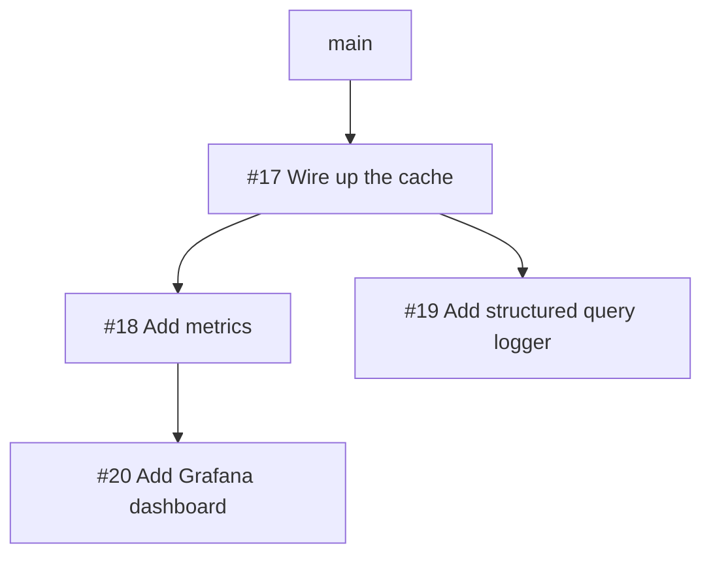

# nspr — GitHub-Native Stacked Pull Requests

> [!WARNING]
> **THIS PROJECT IS 100% LLM-GENERATED.**
> It has been tested quite thoroughly (with unit tests and against real GitHub repositories), **but the internal code quality is likely bad** (though hopefully good enough for a random script). Use at your own risk!

`nspr` is a fast, ergonomic CLI for managing **GitHub-native stacked pull requests** from a single linear local branch.

If you are used to [spr](https://github.com/spacedentist/spr), `nspr` gives you the exact same local workflow (one branch, one commit per pull request, `git rebase -i` to edit) while integrating directly with GitHub's native **Stacked Pull Requests** (`POST /repos/{owner}/{repo}/stacks`):

1. **Native GitHub Stacks**: Each pull request targets the head branch of the commit below it (`base: users/you/layer-1`) and is automatically registered as a native GitHub Stack — so GitHub's **"Merge stack"** and **"Rebase stack"** Web UI buttons work out of the box without manual linking.
2. **1-Parent Linear Revisions & Incremental Review History**: Updating a commit appends a 1-parent fast-forward commit when its base has not moved, and replays individual revision commits (`v1 -> v2 -> ...`) onto the new parent tip when restacking — keeping every PR branch strictly 1-parent linear while preserving commit-by-commit review history.

```text
Local Git History (1 branch)          GitHub Pull Requests (Native Stack)
────────────────────────────          ───────────────────────────────────
  C3  Add Grafana dashboard    ───►   PR #20 (base: users/you/add-metrics)
  C2  Add metrics              ───►   PR #18 (base: users/you/wire-up-cache)
  C1  Wire up the cache        ───►   PR #17 (base: main)
  ──
  main
```

---

## How It Compare to Other Tools

| Feature | `nspr` | `spr` | `gh-stack` / `gt` |
|---|---|---|---|
| **Local workflow** | Single linear branch | Single linear branch | Multiple branches or metadata |
| **GitHub base branch** | Previous PR's branch (Native) | All target `main` (synthetic) | Previous PR's branch (Native) |
| **Updating an amended PR** | **Fast-forward append** | Force-push | Force-push |
| **"Changes since last review"** | **Preserved** | Destroyed on update | Destroyed on update |
| **Branching DAG stacks** | **Supported (`Depends-On:`)** | Linear only | Linear or multi-branch |
| **State storage** | Git commit trailers only | Git commit trailers | Local metadata / refs |

---

## Installation & Setup

```bash
cargo install --path .
```

### Authentication
`nspr` requires a GitHub token (for GraphQL/REST API calls) and Git push access (HTTPS or SSH). It automatically discovers your token in the following order:
1. `$NSPR_GITHUB_TOKEN` environment variable
2. `$GITHUB_TOKEN` environment variable
3. `gh auth token` (if you are logged in with the [GitHub CLI](https://cli.github.com))
4. `git config nspr.githubAuthToken`

If your repository uses SSH (`git@github.com:...`) or `url."git@github.com:".pushInsteadOf`, ensure your `ssh-agent` is running and has your key loaded (`ssh-add -l`). If your SSH agent is unreachable, empty, or times out, `nspr` will diagnose the exact issue and suggest a fix.

---

## Day-to-Day Workflow

### 1. Create a Stack
Work on your branch (`main` or a feature branch) and create commits normally. Each commit will become one pull request:

```bash
git commit -m "Wire up the cache"
git commit -m "Add metrics"
git commit -m "Add Grafana dashboard"
```

Run `nspr diff` (or simply `nspr`) to create the stacked pull requests on GitHub:

```bash
$ nspr diff
  created    https://github.com/owner/repo/pull/17  users/you/wire-up-the-cache
  created    https://github.com/owner/repo/pull/18  users/you/add-metrics
  created    https://github.com/owner/repo/pull/20  users/you/add-grafana-dashboard
```

`nspr` automatically records the PR URL as a `Pull-Request:` trailer in each local commit message and posts a live navigation comment on every PR in the stack.

### 2. Inspect Status
Use `nspr status` to see your local stack top-down (`HEAD` at the top, `main` at the bottom) and what `nspr diff` would do next:

```bash
$ nspr status
     #20  ok          Add Grafana dashboard
     #18  ok          Add metrics
     #17  ok,landable  Wire up the cache
                      main
```

Or use `nspr list` to view all open pull request stacks across the repository with GitHub review badges:

```bash
$ nspr list
#17  [Approved]  Wire up the cache
  #18  [Pending]   Add metrics
    #20  [Pending]   Add Grafana dashboard
```

### 3. Amend Any Commit in the Stack
To address review feedback on an earlier commit (e.g. PR #17):

1. Use interactive rebase (`git rebase -i main`) or `git commit --amend` to edit the commit.
2. Run `nspr diff`:

```bash
$ nspr diff -m "Address review feedback on cache TTL"
  updated    https://github.com/owner/repo/pull/17  users/you/wire-up-the-cache
  refreshed  https://github.com/owner/repo/pull/18  users/you/add-metrics
  refreshed  https://github.com/owner/repo/pull/20  users/you/add-grafana-dashboard
```

* **Code-only updates**: When you only change files in a commit, `nspr` synthesizes a fast-forward commit on `#17`, so **nothing is force-pushed**. Reviewers on `#17` can click *"Changes since your last review"* and see only your fix, while untouched upper layers (`#18`, `#20`) are skipped completely unless a 3-way merge conflict refresh is needed.
* **Commit message updates**: If you edit a commit's title or body locally (or pull Web UI edits via `nspr amend`), `nspr diff` automatically rewrites the first commit on that PR's branch (replaying any revision commits on top of it) and updates the GitHub PR title and description so the branch's initial commit message always matches the PR message.

### 4. Land Pull Requests (`nspr land`)

#### Which commit does `nspr land` merge? (Why not `HEAD`?)
In a single-PR workflow (like `gh pr merge`), your branch has one PR (`HEAD`), so merging `HEAD` merges your branch.
In a stacked workflow (`main -> #17 -> #18 -> #20 (HEAD)`), your `HEAD` commit (`#20`) is stacked on top of `#18` and `#17`. Merging `#20` directly into `main` would squash all three PRs into a single giant commit on `main`. Therefore, **stacked pull requests must land from the bottom of the stack upward** (`#17` first, then `#18`, then `#20`), unless a commit explicitly declares `Depends-On: main`.

To prevent confusion when your git checkout is at `HEAD` (`#20`) while the landable commit (`#17`) is further down the stack:
* **Single-commit stack (`main..HEAD` has 1 commit)**: `HEAD` *is* the bottom of the stack, so bare `nspr land` merges it immediately.
* **Single independent PR among WIP commits (e.g. created via `nspr diff --cherry-pick`)**: If your branch has unsubmitted WIP commits alongside a single independent PR (`Depends-On: main`), bare `nspr land` recognizes that it is the only open root PR on your branch and lands it immediately.
* **Multi-PR stack (`main..HEAD` has 2+ open PRs)**: Bare `nspr land` refuses to guess and prompts you to specify what you want to land:
  * `nspr land --pr=17` (or `nspr land #17`): Land a specific root PR (`#17`).
  * `nspr land --bottom` (or `-b`): Land the lowest ready PR at the bottom of the stack.
  * `nspr land --cherry-pick` (or `-c`): Land the independent `HEAD` PR created with `--cherry-pick` / `Depends-On: main`.
  * `nspr land --all` (or `-a`): Land all approved/ready PRs in bottom-up order (`#17`, then `#18`, then `#20`).

```bash
$ nspr land --pr=17
landed #17 Wire up the cache as 8f3a1b2
  repaired #18
```

When landing a layer, `nspr land` safely:
1. Retargets direct dependents (`#18`) on GitHub from `#17`'s branch to `main`.
2. Squash-merges `#17` onto `main` using your clean local commit message and trailers (stripping `[nspr]` revision commits and web UI warning banners).
3. Re-anchors `#18` and `#20` onto the new squash commit diff-neutrally so their GitHub diffs and inline review comments stay intact.
4. Deletes `#17`'s remote branch and rebases your local git branch onto `main` so `#17` drops out cleanly.

> [!WARNING]
> **Always use `nspr land` instead of the GitHub Web UI merge button.**
> Clicking "Squash and merge" in the GitHub web UI on a stacked PR either merges a child PR into its parent feature branch instead of `main`, or creates a squash commit on `main` whose SHA is missing from dependent PRs (causing their diffs on GitHub to explode with duplicate changes).
> To protect reviewers, `nspr` automatically places a prominent warning callout at the top of stacked PR descriptions on GitHub.

---

## Branching Stacks (DAGs) & Cherry-Picking (`--cherry-pick`)

By default, each commit depends on the commit immediately below it. However, you often want to submit a quick bugfix or independent commit without waiting for your lower WIP commits to be reviewed.

### Submitting Only `HEAD` (`nspr diff --cherry-pick`)
If you are working on top of unsubmitted WIP commits (`A` and `B`) and want to submit **only your `HEAD` commit (`C`)** as an independent pull request targeting `main`:

```bash
nspr diff --cherry-pick   # or: nspr diff -c
```

`nspr diff --cherry-pick` automatically:
1. Adds `Depends-On: main` to `HEAD`'s commit message.
2. Performs a 3-way tree merge to cherry-pick `HEAD`'s changes directly onto `main` (verifying that `HEAD` does not conflict with `main`).
3. Creates or updates **only `HEAD`'s pull request** against `main`, leaving lower commits `A` and `B` completely untouched locally (no PRs created for them).
4. Once approved, run `nspr land` (or `nspr land -c`) to merge `HEAD` onto `main` and rebase your remaining local WIP commits onto the new `main`.

### Declaring Arbitrary DAG Dependencies (`Depends-On:`)
If commit `C3` depends on `C1` (`#17`) but is independent of `C2` (`#18`), add a `Depends-On:` trailer to `C3`'s commit message:

```text
Add structured query logger

This logger is independent of the metrics layer.

Depends-On: #17
```

When you run `nspr diff`, `nspr` performs a three-way tree merge to exclude `C2`'s files from `#19`'s branch and targets `#17` as its base:



- **Independent Review & Landing**: If `#17` lands, both `#18` and `#19` become roots targeting `main`. If `#19` is approved first, you can land it immediately with `nspr land --pr=19` while `#18` is still under review!
- You can also write `Depends-On: main` to make any commit in your local stack target `main` directly as an independent root PR.

---

## In-PR Stack Navigation Comments

`nspr` maintains an automatically updated comment on every pull request in a stack so reviewers always know where they are.

For **linear stacks**, the list renders completely flat (like Graphite):

> #### Stack
> - `main`
> - #17 Wire up the cache
> - ➡️ **#18 Add metrics**
> - #20 Add Grafana dashboard
>
> <sub>Managed by [nspr](https://github.com/arichardson/nspr). Each pull request shows only its own changes.</sub>

For **branching DAG stacks**, `nspr` automatically switches to hierarchical tree indentation so parallel branches are visually distinct:

> #### Stack
> - `main`
>   - #17 Wire up the cache
>     - ➡️ **#18 Add metrics**
>       - #20 Add Grafana dashboard
>     - #19 Add structured query logger
>
> <sub>Managed by [nspr](https://github.com/arichardson/nspr). Each pull request shows only its own changes.</sub>

---

## Command Reference

| Command | Usage | Description |
|---|---|---|
| **`nspr diff`** | `nspr diff [OPTIONS]` | Create or update pull requests for commits between `origin/main` and `HEAD`. Pass `-c / --cherry-pick` to submit only `HEAD` targeting `main`. *(Default command when running `nspr`)* |
| **`nspr status`** | `nspr status` | Show local stack status, sync state (`ok`, `modified`, `restack`, `spr`), and which layers are `landable`. |
| **`nspr list`** | `nspr list [--all]` | List open pull request stacks on GitHub with review status badges (`--all` shows all repo authors). |
| **`nspr land`** | `nspr land [--pr=<PR> \| -b \| -c \| --all]` | Squash-merge a landable pull request onto trunk and repair dependent layers. Use `--pr=<PR>` for a specific root PR, `-b / --bottom` for the lowest ready PR, `-c / --cherry-pick` for an independent `HEAD` PR, or `--all` to land all ready layers bottom-up. |
| **`nspr sync`** | `nspr sync` | Fetch upstream trunk, rebase local commits, drop PRs merged out-of-band, and restack surviving remote branches. |
| **`nspr amend`** | `nspr amend` | Pull PR titles and descriptions edited in the GitHub web UI back into your local git commit messages (automatically stripping UI warning banners). |
| **`nspr patch`** | `nspr patch <PR> [-b <branch>]` | Fetch a PR and its entire upstream stack chain into a local branch (`pr/<number>` by default) for local testing or review. |
| **`nspr close`** | `nspr close <PR>` | Close a pull request on GitHub, drop its commit from your stack, and restack dependent layers onto its parent. |
| **`nspr upgrade`** | `nspr upgrade` | Convert existing `spr` pull requests (`[spr]` branch commits, `Pull Request:` trailers, and `spr/main/master.*` synthetic bases) in-place into native `nspr` stacked pull requests. |

### Migrating Existing `spr` Stacks (`nspr upgrade`)
If you have an existing branch with open pull requests created by `spr` (`spacedentist/spr` or `ejoffe/spr`):
1. `nspr` automatically recognizes `spr`'s `Pull Request: <url>` commit trailer (with a space) as well as the tell-tale `[spr]` commit messages (`[spr] initial version`) and synthetic base branches (`spr/main/master.<id>`) on GitHub.
2. Running `nspr status` flags un-upgraded layers as `spr (run 'nspr upgrade')`, and `nspr diff` refuses to overwrite them until you migrate.
3. Run `nspr upgrade` to convert the entire stack in-place while keeping your existing PR numbers, comments, and approvals:
   - Rewrites each PR's head branch onto its parent PR's head branch using your real commit message (replacing `[spr] initial version`).
   - Retargets each PR's `base` branch on GitHub from `spr`'s synthetic base branch to the parent PR's head branch.
   - Deletes `spr`'s orphaned synthetic base branches (`spr/main/master.*`) from the remote.
   - Normalizes local `Pull Request:` trailers to `Pull-Request:`.

### Common Flags for `nspr diff`
- `-c, --cherry-pick`: Mark `HEAD` with `Depends-On: main` and create/update only `HEAD`'s pull request against trunk (ignoring lower unsubmitted commits).
- `-m, --message <MSG>`: Supply an update message for fast-forward commits without an interactive prompt.
- `--no-prompt`: Use the default update message (`[nspr] update`) non-interactively.
- `--update-message`: Overwrite existing GitHub PR titles and descriptions with your local commit messages.
- `--draft`: Create new pull requests as drafts.
- `-a, --all`: Push every layer even if its displayed patch has not changed.

---

## How Linear Revision History & Conflict Prevention Work

GitHub computes a pull request's diff as the **three-dot diff** between the merge-base and the head tip:

$$\text{Diff}(\text{base}, \text{head}) = \text{Tree}(\text{head}) - \text{Tree}(\text{merge\_base}(\text{base}, \text{head}))$$

`nspr` maintains three properties across every pull request branch:
1. **1-Parent Linear Commits**: Every commit on every PR branch has strictly one parent (`parent_count() == 1`). Because there are never 2-parent merge commits on PR branches, GitHub's native **"Merge stack"** and **"Rebase stack"** Web UI buttons can cherry-pick and rebase the entire stack cleanly.
2. **Incremental Revision History**: When you amend a layer whose base has not moved, `nspr diff` appends a 1-parent fast-forward commit onto the existing head tip. When a lower layer is updated or landed, `nspr` replays the upper layer's individual revision commits (`v1 -> v2 -> ...`) on top of the new parent tip so reviewers can still inspect incremental commit-by-commit diffs on the PR.
3. **Batch Remote Operations**: All branch updates across a stack are pushed in a single `git push` invocation, requiring only a single SSH / security-key confirmation regardless of stack height.

### What happens if updating a lower layer causes a merge conflict on an upper layer?
* **When rebasing locally (`git rebase -i`)**: If modifying commit `C1` conflicts with commit `C2` locally, Git pauses during `git rebase -i` so you resolve the conflict in your working tree before running `nspr diff`.
* **In a DAG stack (`Depends-On:`)**: If commit `C1` (or `main`) is updated and a dependent commit `C2` (`Depends-On: #17`) no longer applies cleanly onto `C1`'s new tree, `nspr diff` detects the conflict during preflight tree construction (`git merge-tree`) and aborts before pushing anything, reporting the exact conflicting files.
* **Proactive GitHub merge-conflict prevention**: When `C1` is updated on GitHub (`new_head_1`), `nspr diff` normally skips pushing `C2` if `C2`'s displayed patch has not changed (preserving CI and approvals on `C2`). However, `nspr` also simulates GitHub's 3-way merge check (`merge_trees(merge_base(old_head_1, old_head_2), new_head_1, old_head_2)`) before deciding to skip `C2`. If updating `C1`'s branch would cause GitHub to flag `C2`'s un-updated remote branch as conflicting (`"This branch has conflicts that must be resolved"`), `nspr diff` automatically refreshes `C2`'s branch in the same run so `C2` stays cleanly mergeable on GitHub.

---

## Configuration

Configuration is optional; `nspr` auto-detects settings from your git remote. You can override defaults via `git config`:

| Git Config Key | Default | Description |
|---|---|---|
| `nspr.repository` | Auto-detected from remote | GitHub repository slug (`owner/repo`). |
| `nspr.trunk` | Auto-detected (`origin/HEAD` or `main`) | Trunk branch name. |
| `nspr.branchPrefix` | `users/<github-login>/` | Prefix for remote PR branch names. |
| `nspr.preserveCommitHistory` | `auto` | Controls whether `nspr diff` pushes incremental `[nspr]` update commits (`true`) or force-pushes a single commit per PR branch (`false`). See below. |
| `nspr.draftWhileRetargeting` | `false` | Flip a pull request to draft while its base branch is being changed, then flip it back. See below. |
| `nspr.stackComments` | `true` | Post/update stack navigation comments on PRs. |
| `nspr.githubAuthToken` | — | Fallback GitHub personal access token. |

### Repository Merge Settings & `nspr.preserveCommitHistory`

When `nspr` pushes incremental `[nspr]` update commits to a pull request branch, the branch contains multiple commits (`initial commit` + `[nspr] update` commits). For merging via the GitHub Web UI to produce a single clean commit on trunk, the repository's GitHub settings (**Settings → General → Pull Requests**) must be configured with:
- Only **Allow squash merging** enabled (`allow_merge_commit = false` and `allow_rebase_merge = false`), and
- Default squash commit message set to **Pull request title and description** (`PR_TITLE` + `PR_BODY`, rather than GitHub's default `COMMIT_MESSAGES` which concatenates all branch commits).

`nspr.preserveCommitHistory` (`auto` by default) automatically checks these repository settings via the GitHub API:
- **`auto` (default)**: Uses incremental `[nspr]` commits without force-pushing when the repository is configured for squash-only merging with `PR_TITLE` + `PR_BODY`. If the repository allows merge/rebase commits or uses `COMMIT_MESSAGES`, `nspr` safely falls back to **force-pushing a single commit per PR branch** and prints a CLI warning explaining how to configure the repository or set `nspr.preserveCommitHistory` to `true` or `false`.
- **`false`**: Always rewrites each PR branch as a single clean commit and force-pushes on updates (silencing the repository settings warning). Because every PR branch has only 1 commit, merging in the GitHub Web UI works cleanly regardless of the repository's merge settings.
- **`true`**: Always pushes incremental `[nspr]` commits without force-pushing. If the repository is not configured for squash-only + `PR_TITLE`/`PR_BODY`, `nspr` emits a CLI warning and appends a disclaimer at the bottom of the PR description reminding reviewers to select **Squash and merge** and use the PR title and description.

### Retargeting a Pull Request & `nspr.draftWhileRetargeting`

Moving a pull request to a different base branch takes two separate GitHub operations: pushing the new head, and changing the base. They cannot be done atomically, and GitHub recomputes the three-dot diff after each one.

The naive order — re-anchor the head onto the new base branch, then change the base — briefly shows the pull request as containing **every commit the new base has and the old one does not**. That file list is handed straight to `CODEOWNERS`, and the resulting review requests are never withdrawn when the diff shrinks again a second later. On a repository like `llvm/llvm-project` that can mean subscribing a dozen unrelated people to your pull request.

`nspr` avoids this by **parking** the branch: when the old and new base branches disagree, the head is re-anchored onto their merge base, which is an ancestor of both, so the displayed diff is the layer's own patch before the base change and after it. The branch is left slightly behind its new base, which is the ordinary state of any stack whose trunk has moved on, and is repaired by the next push that has a reason to happen (or immediately, if the repository requires branches to be up to date before merging).

`nspr.draftWhileRetargeting` (`false` by default) adds a second line of defence: the pull request is flipped to draft before the push and back to ready once the base is correct, and draft pull requests are exempt from `CODEOWNERS` auto-assignment entirely. It is off by default because parking already keeps the diff correct, marking a pull request ready again re-runs the assignment anyway, and a draft left behind by an interrupted run is its own kind of mess. Turn it on if your repository's `CODEOWNERS` file is big enough that a mistake is expensive.

A pull request that is retargeted at the trunk also stops being part of a stack, so `nspr` takes its stack navigation comment down rather than leaving a table claiming it is blocked on work it no longer depends on. Anything a human wrote in the same comment is kept.

---

## Known Limitations

- **Git `reftable` format**: `libgit2` does not yet support repositories initialized with `--ref-format=reftable`. If you encounter a `refstorage` error, convert your repository refs to the standard files backend:
  ```bash
  git refs migrate --ref-format=files
  ```

## License

Apache License 2.0 (see [LICENSE](LICENSE)). Inspired by [spr](https://github.com/spacedentist/spr) and [Git Town](https://www.git-town.com).
